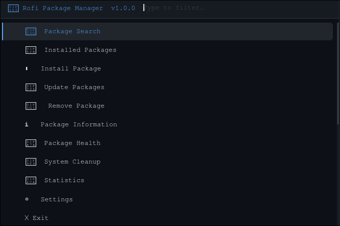

<div align="center">

<h1>
  
  <br/>
  Rofi Package Manager
</h1>

<p align="center">
  <strong>A unified, terminal-free package management frontend for Arch Linux.</strong><br/>
  Search, install, update, and remove packages from Pacman, AUR, and Flatpak — all inside Rofi.
</p>

<p align="center">
  
  
  
  
  
</p>

<p align="center">
  
  
  
</p>

<br/>

<!-- SCREENSHOT PLACEHOLDER — replace with your actual screenshot -->
<!--  -->

<br/>

</div>

---

## ✨ What is this?

You launch **`rofi-package-manager`** and you get a full package management dashboard — right inside Rofi. No terminal. No typing commands. No forgetting flags.

One interface to rule:
- **Pacman** — official Arch repos
- **AUR** — via `yay` or `paru`
- **Flatpak** — any remote

---

## 🖥️ Screenshots

> _Add your screenshots here after taking them. Suggested naming below._

| Main Menu | Search Results | Package Info |
|:---------:|:--------------:|:------------:|
| `screenshots/main_menu.png` | `screenshots/search.png` | `screenshots/pkg_info.png` |

| Health Dashboard | Update Center | System Cleanup |
|:----------------:|:-------------:|:--------------:|
| `screenshots/health.png` | `screenshots/updates.png` | `screenshots/cleanup.png` |

---

## 🚀 Features

<table>
  <tr>
    <td>🔍 <b>Unified Search</b></td>
    <td>Search Pacman, AUR (via HTTP API), and Flatpak — in parallel, in one list</td>
  </tr>
  <tr>
    <td>📋 <b>Browse Installed</b></td>
    <td>All packages, official, AUR/foreign, Flatpak, explicitly installed, deps, orphans</td>
  </tr>
  <tr>
    <td>⬇️ <b>Install</b></td>
    <td>Pacman, AUR (yay/paru/trizen), Flatpak — with optional confirmation dialogs</td>
  </tr>
  <tr>
    <td>🗑️ <b>Remove</b></td>
    <td>Auto-detects source, runs <code>pacman -Rns</code> — removes deps and configs</td>
  </tr>
  <tr>
    <td>🔄 <b>Update Center</b></td>
    <td>Check and apply updates for each source independently or all at once</td>
  </tr>
  <tr>
    <td>ℹ️ <b>Package Info</b></td>
    <td>Version, repo, size, install date, packager, dependencies, required-by</td>
  </tr>
  <tr>
    <td>🌳 <b>Dependency Explorer</b></td>
    <td><code>pactree</code> integration — visual dependency tree + reverse-dep lookup</td>
  </tr>
  <tr>
    <td>🩺 <b>Health Dashboard</b></td>
    <td>Orphan count, broken packages (pacman -Qk), foreign package list</td>
  </tr>
  <tr>
    <td>🧹 <b>System Cleanup</b></td>
    <td>Remove orphans, clean pacman/AUR/Flatpak caches — one click</td>
  </tr>
  <tr>
    <td>📊 <b>Statistics</b></td>
    <td>Total packages, per-source counts, install size, available updates</td>
  </tr>
  <tr>
    <td>⚙️ <b>Settings</b></td>
    <td>AUR helper, confirm dialogs, cache TTL — configured right inside the app</td>
  </tr>
  <tr>
    <td>🎨 <b>Custom Rofi Theme</b></td>
    <td>Dark theme bundled: <code>#0d1117</code> bg, <code>#58a6ff</code> accent, JetBrains Mono</td>
  </tr>
</table>

---

## 📦 Dependencies

### Required
| Package | Why |
|---------|-----|
| `python3` (3.10+) | The whole app is Python |
| `rofi` | The UI layer |
| `pacman` | Core package management |

### Recommended
| Package | Why |
|---------|-----|
| `yay` or `paru` | AUR install, remove, update |
| `flatpak` | Flatpak support |
| `pacman-contrib` | Provides `checkupdates` (safe update checking) and `pactree` (dep trees) |
| `expac` | Package size stats |

### Optional
| Package | Why |
|---------|-----|
| `polkit` | Graphical `pkexec` for privilege escalation |
| `snap` | Snap package detection |

Install the recommended extras in one shot:
```bash
sudo pacman -S pacman-contrib expac
yay -S expac  # if expac isn't in your repos
```

---

## ⚡ Installation

### Clone & Install

```bash
git clone https://github.com/Mohit-Bhole/RofiBasedPackageManager.git
cd RofiBasedPackageManager
chmod +x install.sh
./install.sh
```

The installer will:
- Copy the project to `/usr/local/lib/rofi-package-manager/`
- Symlink the launcher to `/usr/local/bin/rofi-package-manager`
- Create a default config at `~/.config/rofi-package-manager/config.json`

### Run

```bash
rofi-package-manager
```

Or bind it to a key in your window manager / compositor. For example in **Hyprland**:

```ini
bind = $mainMod, P, exec, rofi-package-manager
```

Or add it to a custom Rofi modi list:

```bash
rofi -show combi -combi-modi "drun,rofi-package-manager"
```

---

## ⚙️ Configuration

Config file lives at: `~/.config/rofi-package-manager/config.json`

```json
{
  "aur_helper":        "yay",
  "show_descriptions": true,
  "confirm_removal":   true,
  "confirm_install":   true,
  "cache_ttl_seconds": 300,
  "theme":             "default",
  "terminal":          null
}
```

| Key | Default | Description |
|-----|---------|-------------|
| `aur_helper` | `"yay"` | AUR helper to use (`yay`, `paru`, `trizen`) |
| `show_descriptions` | `true` | Show package descriptions in search results |
| `confirm_removal` | `true` | Yes/No dialog before removing a package |
| `confirm_install` | `true` | Yes/No dialog before installing a package |
| `cache_ttl_seconds` | `300` | How long to cache package lists (seconds) |
| `theme` | `"default"` | Rofi theme file name (in `themes/`) |
| `terminal` | `null` | Override terminal emulator (auto-detected if null) |

> All settings are also editable live from within the app under **⚙ Settings**.

---

## 🏗️ Architecture

The project is intentionally modular — `main.py` only handles menu navigation. All logic is in separate modules.

```
rofi_package_manager/
│
├── main.py                  # Entry point — menus & routing ONLY
│
├── modules/
│   ├── search.py            # Parallel search: Pacman, AUR API, Flatpak
│   ├── install.py           # Install via pacman / AUR helper / flatpak
│   ├── remove.py            # Remove with auto source-detection
│   ├── update.py            # Check + apply updates for all sources
│   ├── info.py              # Package info, dep trees, system stats
│   ├── source.py            # detect_source() — which PM owns a package?
│   ├── health.py            # Orphans, integrity check, health dashboard
│   └── cleanup.py           # Cache cleaning, orphan removal
│
├── utils/
│   ├── rofi.py              # ALL Rofi subprocess calls (single source of truth)
│   ├── commands.py          # run_command, run_privileged, tool_available
│   └── cache.py             # Two-level TTL cache (memory + disk)
│
├── config/
│   └── settings.py          # ~/.config/rofi-package-manager/config.json
│
├── themes/
│   └── default.rasi         # Bundled dark Rofi theme
│
├── rofi-package-manager     # Executable launcher (symlinked to /usr/local/bin)
└── install.sh               # System installer
```

### Design Rules

- **`main.py` has zero business logic** — it only routes menu choices to modules
- **All Rofi calls go through `utils/rofi.py`** — nothing else calls subprocess with `rofi`
- **`BACK` / `EXIT` sentinels** are defined once, imported everywhere — never hardcoded strings
- **Cache is invalidated by the module that mutates state** — install/remove/update each clear their own keys
- **AUR search uses the HTTP API** — no AUR helper needed just to search

---

## 🔐 Privilege Escalation

Install, remove, and update operations that need `sudo` open a **real terminal window**. You type your password there, naturally, and the window closes when done.

Resolution order:
1. `pkexec` (polkit graphical dialog) — if available
2. Auto-detected terminal emulator (`kitty` → `alacritty` → `xterm` → `gnome-terminal`)

No passwords are stored anywhere.

---

## 💾 Caching

Package lists are cached in `~/.cache/rofi-package-manager/` with a configurable TTL (default 5 minutes). This means navigating between menus is instant — no re-running `pacman -Q` every time.

The cache has two levels:
- **Memory** (fastest) — in-process dict, gone on exit
- **Disk** — JSON files, persists between launches, respects TTL

Clear anytime from **⚙ Settings → Clear Package Cache**.

---

## 🗺️ Roadmap

- [x] Unified Pacman + AUR + Flatpak search
- [x] Package info card with full metadata
- [x] Dependency tree explorer (`pactree`)
- [x] Health dashboard (orphans, broken packages)
- [x] System cleanup (caches + orphans)
- [x] Statistics screen
- [x] Two-level TTL cache
- [x] Custom bundled Rofi theme
- [ ] Snap support
- [ ] Cargo package listing
- [ ] AUR package submission helper
- [ ] Rofi `modi` integration (show as a rofi mode, not a separate window)
- [ ] AUR PKGBUILD viewer
- [ ] Package changelog viewer

---

## 🤝 Contributing

Pull requests are welcome! If you want to add support for a new package manager or improve existing modules:

1. Fork the repo
2. Create a feature branch: `git checkout -b feature/snap-support`
3. Follow the architecture rules above (especially: keep `main.py` logic-free)
4. Open a PR

---

## 📄 License

MIT License — see [LICENSE](LICENSE) for details.

---

<div align="center">

**Built for Arch Linux power users who love Rofi.**

_If this project helped you, consider leaving a ⭐_

</div>
