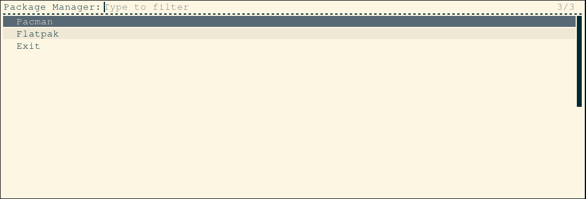
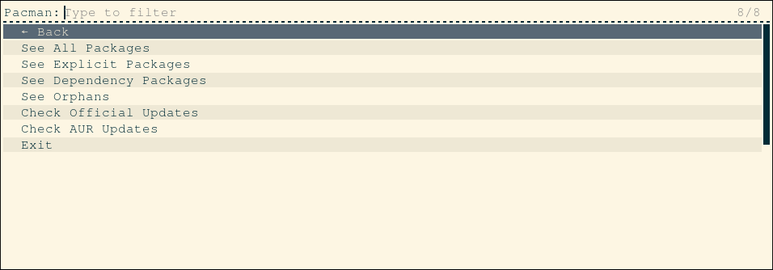
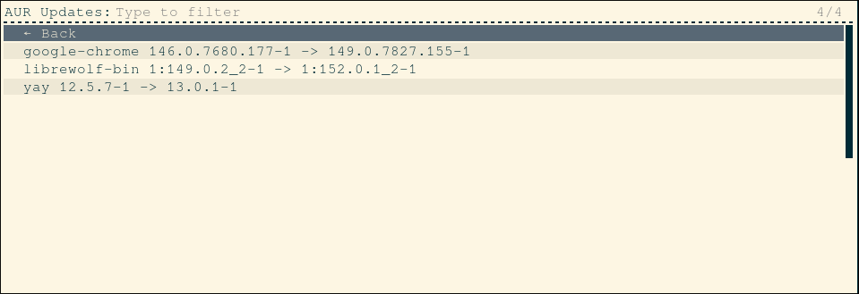

<div align="center">

# 📦 RofiBasedPackageManager

### Lightweight Package Management for Arch Linux using Python + Rofi

View, search, and manage packages installed through **Pacman**, **AUR Helpers**, and **Flatpak** from a fast keyboard-driven interface.


</div>

---

## ✨ Features

### 📦 Pacman

* View all installed packages
* View explicitly installed packages
* View dependency packages
* View orphan packages
* Check official repository updates
* Check AUR updates

### 📦 Flatpak

* View installed Flatpak applications
* Check Flatpak updates

### ⌨️ Interface

* Fast Rofi-based navigation
* Fully keyboard driven
* Lightweight
* No heavy GUI dependencies

---

## 📸 Screenshots

### Main Menu

<p align="center">
  
</p>

### Pacman Menu

<p align="center">
  
</p>

### Package Listing

<p align="center">
  
</p>

---

## 🚀 Installation

Clone the repository:

```bash
git clone https://github.com/Mohit-Bhole/RofiBasedPackageManager.git
cd RofiBasedPackageManager
```

Run setup:

```bash
chmod +x setup.sh
sudo ./setup.sh
```

Or install dependencies manually:

```bash
sudo pacman -S python rofi
```

Optional:

```bash
sudo pacman -S flatpak
yay -S yay
```

---

## ▶️ Usage

Run:

```bash
PackageViewer
```

or

```bash
python GuiPackageManager.py
```

---

## 🗺️ Roadmap

### v0.2

* Package information viewer
* Package metadata using `pacman -Qi`
* Installation source detection

### v0.3

* Dependency tree viewer
* Reverse dependency viewer
* Package file listing

### v0.4

* Package removal support
* Package reinstall support
* Confirmation dialogs

### Future

* Paru support
* Snap support
* Search functionality
* Package statistics dashboard
* Package size analysis
* Theme system
* QML frontend

---

## 🎯 Project Vision

RofiBasedPackageManager aims to become a lightweight package management frontend capable of managing packages installed through:

* Pacman
* Yay
* Paru
* Flatpak
* Snap

while preserving the speed and simplicity of Rofi.

Future versions may include a QML frontend for desktop environments such as:

* KDE Plasma
* GNOME
* XFCE
* Cinnamon

and support for distributions such as:

* Fedora
* Debian
* Linux Mint

---

## 📄 License

Released under the MIT License.
